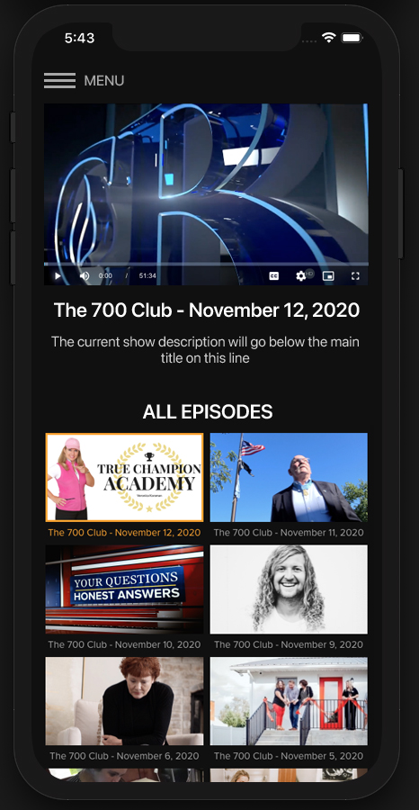
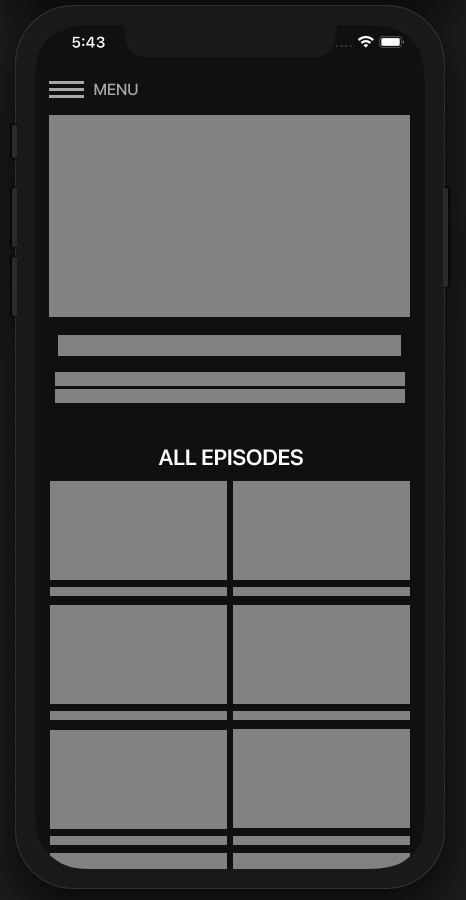
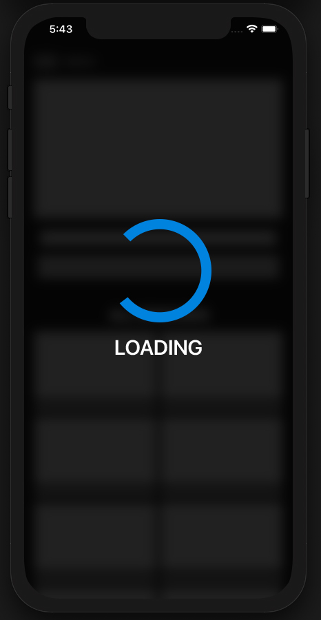
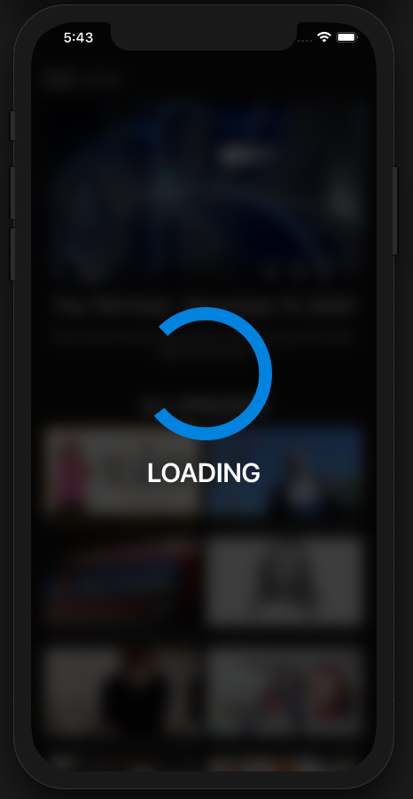
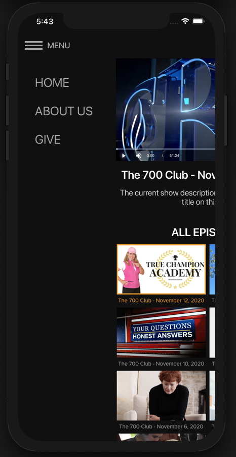
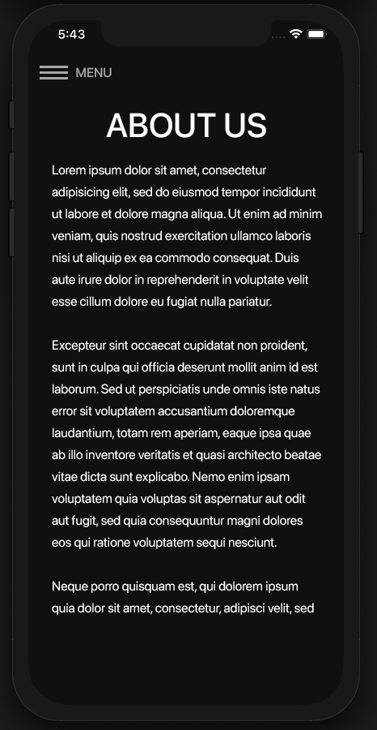

# View completed project at
https://www.s-it-e.com/project/build/

## Overview

The goal of this project is to create a native-wrapped single-page React web application that runs on either iOS or Android (your choice of platform, bonus points for both).  The application's IPA or APK should be properly signed and side-loadable, meaning it does not require loading from the App Store (we will supply you the device ID's for an iOS Adhoc profile if you choose iOS).

The application will download a JSON feed from https://www1.cbn.com/app_feeds/rss/news/roku.php?v=34, and will create a single page with a video player at the top of the page and the contents of the Faith Nation series as a gallery below the player for the user to select and play.  You can find the contents for Faith Nation in the JSON feed under `series` and look for an `id` value of `news-show-faith-nation`.  Please note that the wireframes are using the 700 Club show for demonstration purposes, but here we will specifically be using the contents of the Faith Nation show only.

Additionally, the App will have an `About` page as a navigation feature, as well as open up a `Giving` page at https://www.cbn.com/giving/700club/contribute.aspx using either the build-in Android Chrome browser or a `SFSafariViewController` on iOS. Once on the giving page the user should be able to get back to the app easily using the Android back button, or on iOS, by closing the `SFSafariViewController`.

The app should have a loader screen when it first launches.  If there is no content that has been loaded, a proxy screen should be used that adds gray-boxes as placeholders for the player, the show title, and the gallery items below, as well as the titles for the gallery items. Once the feed content has been loaded and processed, the proxy content will be replaced with actual content.

## Wireframes

### Home Screen

The home screen is the main screen for the app after all the content from the feed has loaded.  There is a video player at the top of the screen (the controls on the video player are just for an example, your video player controls may look a bit different depending on what library and platform you use), the title of the current show that is loaded in the video player below the screen, and then the description of that show epsiode below the title.  Below that is a gallery that lists out all the items for the current show. In this example it's the 700 Club, but in your case it will be the Faith Nation show using the data feed provided.  The entire page should scroll in order to reveal the rest of the content in the gallery.  The currently selected and playing show should be highlighted with an orange border and orange text as depicted in the wireframe. 

For the menu at top you can choose to use a fixed menu header that does not scroll with the page, or have the menu scroll with the rest of the page. The choice is yours.

### Proxy Screen

The Proxy screen is a placeholder screen for when content has not been loaded into the app yet.  The user will typically see this screen behind the loader animation on their first load of the app, or if there is no cached data available.  The proxy screen does not have to scroll, it simply is filled with placeholder elements that will be replaced with the actual content when that has been loaded.

### Initial Loading Screen

There is a loader animation that appears over the main UI whenever the app is loading. The background of the loader is 100% black with 75% opacity so it is see-through. It also blurs the background on platforms that support the CSS `backdrop-filter` property.  The loading animation is a partial circular wheel as pictured that rotates one complete revolution per second.  Below the loader is text that reads "Loading"

### Loading Screen with Content

If content was previously loaded, the loading screen would look like the example above.  This is in contrast to the previously depicted initial loading screen that was overlaid over a proxy screen since there was no initial content loaded in the previous proxy screen example.

### Menu

The menu contains three links:

1. The main home screen
2. An "About Us" page
3. A link to a giving page

When the user clicks on the menu hamburger icon, the main screen will animate-slide over to the right and reveal a menu with the above links.  When the user clicks on a link, the menu will collapse and the new screen will be shown.  You do not have to animate the screen transitions.

For the giving page, please use a `SFSafariViewController` to load the giving page on iOS, or use the Chrome browser on Android.  If you are using iOS, the `SFSafariViewController` should slide on from the right side of the screen.  The menu should also collapse as it would with any other page transition when the `SFSafariViewController` is shown on the screen.  For Android the menu should collapse so that when the user revists the app after being sent to Chrome, the menu is back in it's collapsed state.

### About Us Page

The About Us page is a fairly straight forward page with a title at the top and Loreum Ipsum text underneath.  It's main purpose is to demonstrate the ability to change pages within the single-page application and maintain app state throughout the page transitions.

## CSS Specs

- For the font family use SF Pro for iOS, Roboto for Android, or default sans-serif.
- The color of the primary header text and block copy is #FFFFFF
- The color of the menu header, menu elements, and titles in the gallery is #a7a7a7
- The global background color is #101010
- The color for the loader wheel is #0083df
- The color for the proxy placeholder elements is #828282
- The menu header text size is 16pts
- The menu item text size is 24pts
- The main title text size is 22pts
- The description text size is 16pts
- The About Us block text size is 16pts
- The About Us header size is 40pts
- The gallery title size is 12pts
- The "All Episodes" font size is 20pts
- The Loading text size is 30pts

## App Requirements

1. Use the latest version of React and ReactDOM.  **Do not** use React Native.
2. The native code portion of the app should be written in Swift, Java, or Kotlin using either Xcode or Android Studio. The web code should be a combination of HTML/CSS/JavaScript.
3. There should be a single web-page native view for the application.  This should be a `WKWebView` for iOS, or an `android.webkit.webview` on Android.
4. You are **not allowed** to use [Apache Cordova](https://cordova.apache.org/) or any other "native web-app" tookit, nor are you allowed to use a PWA (progressive web app) for creating the webview-based application.  This project should ideally demonstrate your ability to work with a native `WKWebView` or `android.webkit.webview` in the context of a native application without resorting to third-party frameworks.
5. The web portion of the app should be a single-page application, meaning that you are not switching URL's when changing menu items
6. Demonstrate the ability to properly setup a package manager build workflow and ES6 modules for the web portion using [npm](https://www.npmjs.com/), and either [Webpack](https://webpack.js.org/), [Parcel](https://parceljs.org/) or [Browserify](http://browserify.org/), and transpilation to a generic [ES2015](https://developers.google.com/web/shows/ttt/series-2/es2015) target using [Babel](https://babeljs.io/).
7. Make liberal use of `async` and `await` for asynchronous requests, and use the `fetch` web API for any network requests rather than `XMLHttpRequest`. You are also allowed to use promises without `async/await`, but we would like to see that you are aware of how to use the `async/await` workflow in addition to promises. Make sure to implement proper exception and error handling with any promises and `async/await` functions.
8. The app should auto-reload and fetch a new network feed on launch or re-opening of the app if it has been in the background for more than 1 hour.  If the period of non-use has been less than an hour, then the app should load a locally stored version of the data and not do a new network request for a refresh.  This also applies if the user has dismissed the app, or the OS closes the app while it's in the background to free up resources for other apps running on the device.
9. Appropriate native alert messages should be shown to the user if the network feed request fails or processing on the feed request fails. Use messaging such as "Network unavailable" or "We were unable to process the show feed" if those types of errors occur.  These messages should be using the native platform dialogs and not web dialogs. For instance, on iOS, demonstrate the ability to properly use an `UIAlertController` for any warning messages. Do not use the web API JavaScript `alert` dialog, as those will not show in a `WKWebView` on iOS. 
10. The show in the gallery that the user is currently playing should be highlighted so the user can see what they're playing in the context of the gallery.
11. There should only be 30 items total in the gallery. If there are more than 30 items in the feed for the show, you can truncate the feed.
12. The video player should be an inline video player, which means it will not go full-screen when the user clicks to play.  It should only go fullscreen when the user specifically presses the "fullscreen" button on the player if the platform supports fullscreen playback.
13. The video player should auto-play content if the user clicks on an icon in the thumbnail gallery.  For instance, if the user clicks on a thumbnail in the gallery, and you load the new content, the user should not have to make a second click on the video player in order to start the content.
14. The video player *should not* auto-play when the app first loads and displays the first piece of content to the viewer... auto-play should only occur if the user has clicked on a specific thumbnail to open a specific video.
15. Load the `m3u8` video content contained inside the `videos` > `url` of the JSON schema for each show item.
16. Use a web DOM `<video/>` tag or the open-source [Video.js](https://videojs.com/) library for the video player.
17. Demonstrate the ability to property use ES6 classes for your React components.
18. Demonstrate the ability to use CSS Flex layout.
19. You may not use any external JavaScript runtime libraries other than an optional use of the [Video.js](https://videojs.com/) library as mentioned previously for the video player, [Redux](https://redux.js.org/) for global state management if you need it, [React Router](https://reactrouter.com/) for navigation, and of course the [React](https://reactjs.org/) libraries themselves. This application doesn't require any specific mobile-touch gestures other than taps, so third-party libaries to manage touch-events shouldn't be needed.
20. The wireframes are using the SF Pro font from Apple, which is the default font on iOS, but you can use another sans-serif font if you like, or whatever the native sans-serif font is on the platform your developing for.
